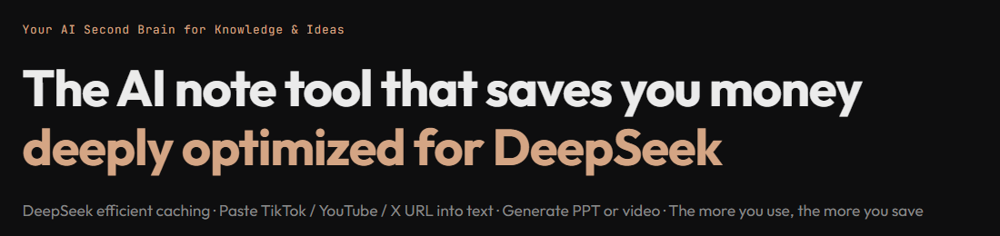
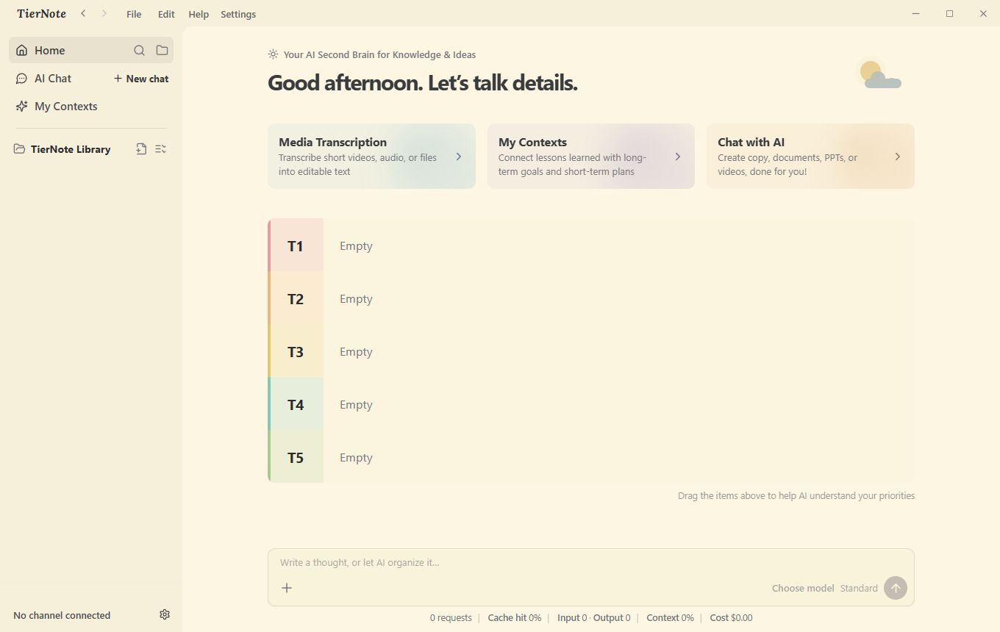
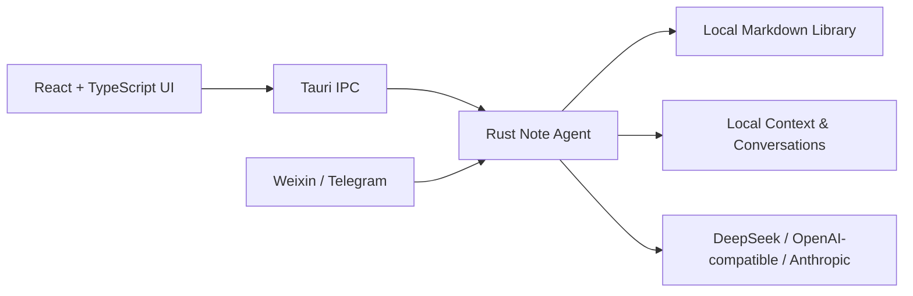

<p align="center">
  
</p>

<div align="center">
  
  <h1>Coffee Note</h1>

  <p>
    <a href="https://github.com/edison7009/Coffee-Note/releases/latest"></a>
    <a href="https://github.com/edison7009/Coffee-Note/actions/workflows/release.yml"></a>
    
    <a href="LICENSE"></a>
  </p>

  <p>
    <a href="https://note.coffeecli.com/">Website</a> ·
    <a href="https://github.com/edison7009/Coffee-Note/releases/latest">Download</a> ·
    <a href="README.zh-CN.md">简体中文</a> ·
    <a href="https://github.com/edison7009/Coffee-Note/issues">Feedback</a>
  </p>
</div>

<p align="center">
  
</p>

## Overview

Coffee Note is a cross-platform desktop note agent built around local Markdown files. Its core experience is an editable **T1–T5 priority map**: your most important notes stay visible, while AI can search, organize, summarize, and create without turning the app into a coding tool or task manager.

| Project | Current state |
| --- | --- |
| Desktop | Windows, macOS, Linux |
| Storage | Local Markdown library and local conversation records |
| Model protocols | OpenAI-compatible APIs and Anthropic Messages API |
| Primary optimization | DeepSeek prefix-cache reuse and usage visibility |
| License | AGPL-3.0-or-later |

> Release binaries are currently unsigned. Windows and macOS may show an unverified-publisher warning during installation.

## What it does

- **DeepSeek-aware AI chat** — stable request prefixes improve cache reuse; requests, cache hits, tokens, context use, and estimated cost remain visible.
- **Library Graph retrieval** — searches titles, paths, headings, body text, Markdown links, and nearby notes without an embedding API, vector database, or indexing tokens.
- **Local-first notes** — browse and edit ordinary Markdown files in a restrained three-pane desktop workspace.
- **T1–T5 priorities** — rank and reorder notes directly from Home so the important work remains legible.
- **My Contexts** — selectively expose goals, experience, lessons, priorities, and key records to AI retrieval.
- **Media to notes** — turn supported video or audio links and local media files into structured notes through cloud or local speech recognition.
- **Document intake** — read text, Markdown, HTML, DOCX, PPTX, XLSX, PDF, images, audio, and video through scoped import tools.
- **Phone capture** — connect Weixin or Telegram and send private webpage or media links back to the desktop for local processing.
- **Replaceable providers** — configure DeepSeek or another OpenAI-compatible endpoint, or use Anthropic's native Messages API.

## Install

Download the appropriate installer from the [latest GitHub Release](https://github.com/edison7009/Coffee-Note/releases/latest), or use the remote installer:

**Windows PowerShell**

```powershell
irm https://note.coffeecli.com/install.ps1 | iex
```

**macOS / Linux**

```bash
curl -fsSL https://note.coffeecli.com/install.sh | sh
```

## Supported platforms

| Platform | Architectures | Packages |
| --- | --- | --- |
| Windows | x64 | NSIS `.exe`, MSI |
| macOS | Apple Silicon, Intel | DMG |
| Linux | x64 | AppImage, DEB, RPM |
| Linux | arm64 | DEB, RPM |

## Architecture



### Under the hood

- **Desktop shell:** Tauri 2 with a React 18, TypeScript, and Vite frontend.
- **Agent runtime:** a focused Rust core in `agent_loop.rs` and `agent_tools.rs`, built for note search, reading, writing, memory routing, and completion-oriented tool use.
- **Safety boundary:** tools operate on the selected library and explicit local files; the agent does not expose arbitrary shell execution or unrestricted filesystem writes.
- **Retrieval:** Library Graph builds a lightweight local relationship map from Markdown structure and links, then returns only relevant passages.
- **Context:** recent conversation, enabled My Contexts pages, the open note, and relevant library passages are routed separately and compacted locally when needed.
- **Networking:** Rust uses `reqwest` with rustls for model streaming, web reading, release checks, and optional transcription services.
- **Media:** local audio decoding uses Symphonia; transcription can use configured cloud services or the local recognition path.

For more detail, see [Architecture](docs/ARCHITECTURE.md), [Note Agent design](docs/NOTE_AGENT.md), and [cost-oriented agent decisions](docs/NOTE_AGENT_SAVINGS.md).

## Repository layout

| Path | Purpose |
| --- | --- |
| `src/` | React desktop UI and TypeScript application logic |
| `src-tauri/` | Rust backend, agent loop, retrieval, file and media handling |
| `starter-knowledge/` | Bilingual first-run library content |
| `tests/` | Frontend and shared-logic tests |
| `docs/` | Architecture, agent, library, and release documentation |
| `website/` | Product site, localized screenshots, installers, and download Worker |
| `.github/workflows/` | Version and cross-platform release automation |

## Development

Prerequisites:

- Node.js 22 or later
- Rust toolchain
- [Tauri platform prerequisites](https://v2.tauri.app/start/prerequisites/) for your operating system

```powershell
npm ci
npm run library:check
npm run typecheck
npm test
npm run tauri:dev
```

Useful verification commands:

```powershell
npm run build
npm run release:check
cargo check --manifest-path src-tauri/Cargo.toml
cargo test --manifest-path src-tauri/Cargo.toml
```

## Privacy and security

- Your note library and complete conversation records stay on your computer by default.
- Only requests you initiate send the selected context to your configured model provider.
- Knowledge-library access is path-scoped and canonicalized to block traversal outside the selected root.
- Provider configuration, including API keys, is stored as plaintext JSON only in the current user's Coffee Note app-data directory. It is never written into this repository or the note library.
- No telemetry service is required for the local note workflow.

## Release process

Tags matching `v*` trigger quality checks and native builds for Windows x64, macOS Apple Silicon, macOS Intel, Linux x64, and Linux arm64. See [RELEASE.md](docs/RELEASE.md) for the version checklist and asset naming rules.

## License & commercial use

**Open-source edition** — Coffee Note is free, forever, under the
[GNU Affero General Public License v3.0 or later (AGPL-3.0-or-later)](LICENSE).
Companies are welcome to use it as-is. Modified versions distributed to others,
and modified versions offered to users over a network, must follow AGPL's source
availability requirements. See [NOTICE](NOTICE) for the legacy MIT notice and
[THIRD_PARTY_NOTICES.md](THIRD_PARTY_NOTICES.md) for third-party acknowledgements.

**Commercial & enterprise licensing** — A paid commercial license is only
needed when you want to step outside AGPL obligations: to customize Coffee Note
and keep the changes closed-source, redistribute it under your own brand or as a
white-label product, or embed it in a proprietary product you distribute. Custom
development, priority support, and SLAs are also available. Tell us what you are
building and we will tailor a plan and quote.

Contact sales: **[hi@coffeecli.com](mailto:hi@coffeecli.com?subject=Coffee%20Note%20Enterprise)**

**Contributing** — See [CONTRIBUTING.md](CONTRIBUTING.md). Contributions are
accepted under the project CLA so commercial relicensing remains possible.
