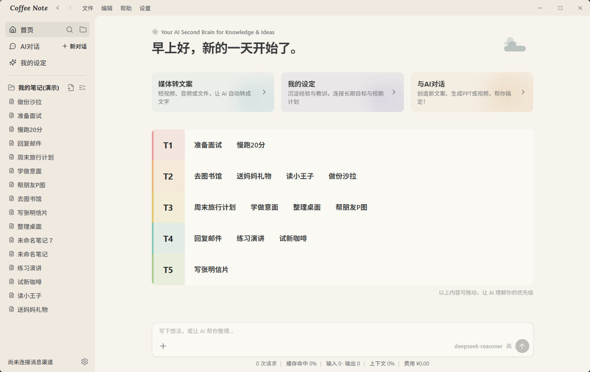
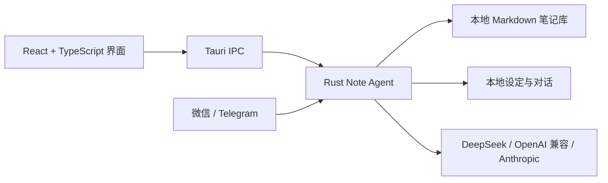

<div align="center">
  
  <h1>Coffee Note</h1>
  <p><strong>本地优先、深度优化 DeepSeek 的 AI 笔记工作台。</strong></p>
  <p>管理 Markdown 笔记、看清优先级、随手收集资料，并用负担得起的模型完成真正有用的 Agent 工作流。</p>

  <p>
    <a href="https://github.com/edison7009/Coffee-Note/releases/latest"></a>
    <a href="https://github.com/edison7009/Coffee-Note/actions/workflows/release.yml"></a>
    
    <a href="LICENSE"></a>
  </p>

  <p>
    <a href="https://note.coffeecli.com/">官网</a> ·
    <a href="https://github.com/edison7009/Coffee-Note/releases/latest">下载</a> ·
    <a href="README.md">English</a> ·
    <a href="https://github.com/edison7009/Coffee-Note/issues">问题反馈</a>
  </p>
</div>

<p align="center">
  
</p>

## 项目概览

Coffee Note 是围绕本地 Markdown 文件构建的跨平台桌面 Note Agent。产品核心是一张可编辑的 **T1–T5 优先级地图**：重要笔记始终保持可见，AI 可以检索、整理、总结与创作，但不会把笔记软件变成编程工具或任务管理器。

| 项目 | 当前状态 |
| --- | --- |
| 最新版本 | **v0.0.8** |
| 桌面平台 | Windows、macOS、Linux |
| 数据存储 | 本地 Markdown 笔记库与本地对话记录 |
| 模型协议 | OpenAI 兼容 API、Anthropic Messages API |
| 核心优化 | DeepSeek 前缀缓存复用与用量可视化 |
| 开源协议 | MIT |

> 当前发布包尚未进行代码签名，Windows 与 macOS 安装时可能提示“未知发布者”或“无法验证开发者”。

## 核心能力

- **DeepSeek 优化的 AI 对话**：稳定请求前缀提高缓存复用机会，对话中直接显示请求数、缓存命中、Token、上下文用量与费用估算。
- **Library Graph 本地检索**：综合标题、路径、章节、正文、Markdown 链接与邻近笔记，无需 Embedding API、向量数据库或索引 Token。
- **本地优先笔记**：在安静的三栏桌面工作区浏览和编辑普通 Markdown 文件。
- **T1–T5 优先级**：直接在首页分级、拖动和排序，让重要内容一目了然。
- **我的设定**：分别控制目标、经验、教训、优先级与重要记录是否参与 AI 检索。
- **媒体转笔记**：通过云端或本地语音识别，将支持的视频、音频链接和本地媒体文件整理成结构化笔记。
- **文档读取**：通过受限导入工具读取文本、Markdown、HTML、DOCX、PPTX、XLSX、PDF、图片与音视频。
- **手机随手收集**：连接微信或 Telegram，私聊发送网页或媒体链接，由桌面端在本机整理保存。
- **模型可替换**：配置 DeepSeek 或其他 OpenAI 兼容服务，也可以使用 Anthropic 原生 Messages API。

## 安装

可以从 [GitHub 最新版本](https://github.com/edison7009/Coffee-Note/releases/latest) 下载对应安装包，或使用远程安装命令。

**Windows PowerShell**

```powershell
irm https://note.coffeecli.com/install.ps1 | iex
```

**macOS / Linux**

```bash
curl -fsSL https://note.coffeecli.com/install.sh | sh
```

## 支持平台

| 平台 | 架构 | 安装包 |
| --- | --- | --- |
| Windows | x64 | NSIS `.exe`、MSI |
| macOS | Apple Silicon、Intel | DMG |
| Linux | x64 | AppImage、DEB、RPM |
| Linux | arm64 | DEB、RPM |

## 技术架构



### 底层实现

- **桌面外壳**：Tauri 2；前端使用 React 18、TypeScript 与 Vite。
- **Agent 运行时**：`agent_loop.rs` 与 `agent_tools.rs` 组成专注笔记场景的自研 Rust 核心，负责检索、读写、记忆路由和完成优先的工具循环。
- **安全边界**：工具只操作已选择的笔记库和用户明确提供的本地文件，不开放任意 Shell，也不允许无限制文件写入。
- **本地检索**：Library Graph 从 Markdown 结构与链接建立轻量关系图，只返回与当前问题相关的片段。
- **上下文路由**：最近对话、已开启的“我的设定”、当前笔记与相关资料分别路由；接近上限时在本地压缩早期上下文。
- **模型通信**：Rust 使用 `reqwest` 与 rustls 完成模型流式请求、网页读取、版本检查与可选语音服务调用。
- **媒体处理**：本地音频解码使用 Symphonia；语音转写可以选择已配置的云服务或本地识别路径。

进一步阅读：[架构说明](docs/ARCHITECTURE.md)、[Note Agent 设计](docs/NOTE_AGENT.md)、[面向成本的 Agent 决策](docs/NOTE_AGENT_SAVINGS.md)。

## 仓库结构

| 路径 | 作用 |
| --- | --- |
| `src/` | React 桌面界面与 TypeScript 应用逻辑 |
| `src-tauri/` | Rust 后端、Agent 循环、检索、文件与媒体处理 |
| `starter-knowledge/` | 首次启动使用的双语示例资料库 |
| `tests/` | 前端与共享逻辑测试 |
| `docs/` | 架构、Agent、资料库与发布文档 |
| `website/` | 产品官网、双语截图、安装脚本与下载 Worker |
| `.github/workflows/` | 版本同步与跨平台发布自动化 |

## 本地开发

环境要求：

- Node.js 22 或更高版本
- Rust 工具链
- 当前操作系统对应的 [Tauri 环境依赖](https://v2.tauri.app/start/prerequisites/)

```powershell
npm ci
npm run library:check
npm run typecheck
npm test
npm run tauri:dev
```

常用验证命令：

```powershell
npm run build
npm run release:check
cargo check --manifest-path src-tauri/Cargo.toml
cargo test --manifest-path src-tauri/Cargo.toml
```

## 隐私与安全

- 笔记库与完整对话记录默认保存在当前电脑上。
- 只有用户主动发起模型请求时，所选上下文才会发送给已配置的模型服务商。
- 知识库访问会进行路径限定和 canonicalize 检查，阻止越过所选根目录。
- 模型配置（包括 API Key）仅以明文 JSON 保存在当前用户的 Coffee Note 应用数据目录，不会写入仓库或笔记库。
- 本地笔记工作流不依赖遥测服务。

## 发布流程

推送 `v*` 标签后，GitHub Actions 会执行质量检查，并原生构建 Windows x64、macOS Apple Silicon、macOS Intel、Linux x64 与 Linux arm64 安装包。版本清单和产物命名规则见 [RELEASE.md](docs/RELEASE.md)。

## 开源协议

Coffee Note 使用 [MIT License](LICENSE)。第三方组件与许可说明见 [THIRD_PARTY_NOTICES.md](THIRD_PARTY_NOTICES.md)。
